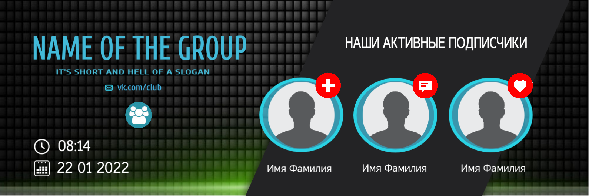

# Designer (Graphics Editor)

| [DEMO](https://alekstar79.github.io/designer/) | [VK GROUP](https://vk.com/netaggregator) | [ARTICLES](https://vk.com/@netaggregator)  | [VIDEO](https://vk.com/video/@netaggregator) |
|:----------------------------------------------:|:----------------------------------------:|:------------------------------------------:|:--------------------------------------------:|

This is an online application, a general-purpose graphic editor. The program interface is represented by a workspace
within which the canvas is located, and all the functionality is integrated in convenient interfaces that can be arranged
and grouped arbitrarily in the application workspace with maximum convenience for comfortable work. In the upper part
of the application window, the main menu of the program is located, which includes all the basic functionality. At the bottom
of the window, there is a panel for accessing images, components and widgets used on the canvas, within the application
document. Side dock toolbars provide quick access to certain application functionality, thereby providing convenience
in operation. All menus and panels, in order to provide the most free workspace, are made floating and hide at the edges
of the browser window. Dock panels additionally allow you to detach them and place them in an arbitrary, convenient place
in the application workspace. Canvas, in turn, allows simple mouse manipulation, dragging (shift + left clk) and scroll wheel,
pan and zoom the application document. Also, it has its own context menu integrated into it, which opens quick access
to its functions. The canvas is equipped with rulers that allow you to set guides (identical photoshop functionality)
and control them through the rulers menu. The stock photo service Pixabay is integrated into the editor, which facilitates
access to graphic resources and thereby removes the issue of independent search for the latter on the Internet.

The dynamic community cover contains useful information for subscribers and updates it when relevant events occur in the group
or on external sources (services). The displayed information, as well as the cover design in general, is easy and flexible,
configurable in the interface of the graphic editor. The editor allows you not just to compose widgets, but to completely
create a design, of almost any complexity, from scratch. At the same time, manipulations on creation, editing are simple
and intuitive. Ultimately, it is possible to simply upload a background image and configure widgets.

Examples:

